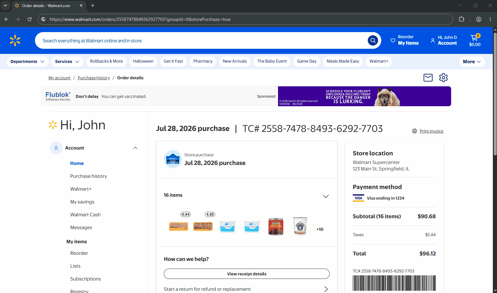
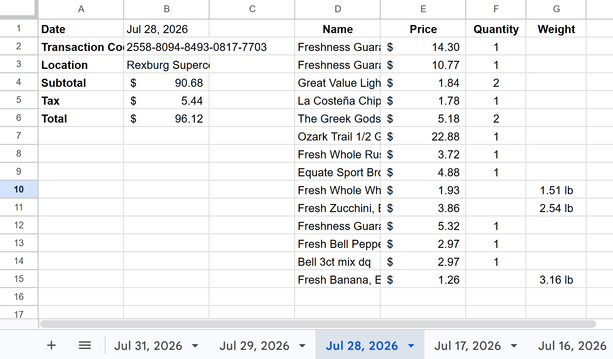

# Walmart Receipt Parser & Automator


A full-stack automation tool designed to extract receipt details directly from Walmart order pages and sync them into organized, custom-formatted Google Spreadsheet tabs. 

Built with a **Chrome Extension (Manifest V3)** frontend and an **Express.js / Google Sheets API** backend, this project eliminates manual data entry by extracting itemized pricing, order totals, taxes, and metadata with a single click.

## Visual Overview

| Chrome Extension Action | Automated Google Sheet Output |
| :---: | :---: |
|  |  |
| *1-Click DOM Parsing on Walmart.com* | *Dynamic tab creation & Accounting formatting* |

## System Architecture

```
┌─────────────────────────────────┐
│     1. Chrome Extension         │
│  (User clicks toolbar icon)     │
└────────────────┬────────────────┘
                 │
                 │ Injects scraper script via chrome.scripting
                 ▼
┌─────────────────────────────────┐
│     2. Walmart Order Page       │
│  (DOM Scraper extracts data)    │
└────────────────┬────────────────┘
                 │
                 │ Sends JSON payload (POST request)
                 ▼
┌─────────────────────────────────┐
│     3. Express API Server       │
│   (Node.js / Vercel backend)    │
└────────────────┬────────────────┘
                 │
                 │ Authenticates & sends batchUpdate
                 ▼
┌─────────────────────────────────┐
│     4. Google Sheets API        │
│   (Appends formatted data)      │
└─────────────────────────────────┘

```

## Key Features

* **Automated DOM Extraction**: Scrapes transaction codes (TC#), order dates, store locations, item names, individual prices, quantities, and weights directly from Walmart order pages.
* **Smart Tab Management**: Automatically creates new spreadsheet tabs named by purchase date and inserts them in chronological order.
* **Duplicate Prevention**: Reads existing sheet records before writing to ensure identical transaction codes (TC#) are not duplicated.
* **Native Cell Formatting**: Uses Google Sheets `batchUpdate` to set dynamic accounting currency formats (`$#,##0.00`), bold headers, text clipping, and auto-spaced item columns.
* **Serverless Architecture**: Utilizes Vercel Serverless Functions for near-instant execution, BYOK security, and zero infrastructure overhead.

## Tech Stack

| Domain | Technology | Description |
| :--- | :--- | :--- |
| **Frontend** | JavaScript (ES6+), Chrome Extension APIs | Manifest V3 script injection & tab inspection |
| **Backend** | Node.js, Express.js | REST API handling POST payloads & Google Auth |
| **Integrations** | Googleapis (`v4`) | Service Account authentication & raw sheet batch updates |
| **Hosting** | Vercel / Localhost | Deployment environment for backend API |

## Project Structure

```
walmart-receipt-parser/
├── docs/
│   ├── extension-demo.gif       # Extension demo gif
│   └── sheets-output.png        # Google Sheets output example
├── extension/
│   ├── icons/             
│   │   └── icon.png             # Extension toolbar icon (180x180 PNG)
│   ├── background.js            # MV3 Service worker & DOM scraping logic
│   ├── manifest.json            # Extension permissions & host access
│   ├── options.html             # UI for uploading credentials & Spreadsheet ID
│   └── options.js               # Options handler for chrome.storage.local
├── scripts/
│   └── format-env.js            # Helper script to format .env JSON strings for local dev
├── server/
│   └── server.js                # Express API & Google Sheets batch update logic
├── .env                         # Local environment variables (User created, ignored by Git)
├── .gitignore                   # Ignore node_modules & sensitive JSON keys
├── LICENSE                      # MIT License
├── package.json                 # Server dependencies
├── README.md                    # Project documentation
└── vercel.json                  # Vercel serverless build & routing configuration
```

## Getting Started

Because this extension writes directly to your personal Google Drive, you must generate your own Google Cloud credentials to use it. 

### Step 1: Install & Configure Chrome Extension (Mandatory)

1. Clone this repository to your computer:
   ```bash
   git clone https://github.com/your-username/walmart-receipt-parser.git
   cd walmart-receipt-parser
   ```
2. Open Chrome and navigate to `chrome://extensions/`.
3. Enable **Developer mode** (top right).
4. Click **Load unpacked** in the top-left corner, navigate into your cloned `walmart-receipt-parser` folder, and select the `extension/` subfolder (where `manifest.json` is located). 
   > **Note:** Make sure to select the inner `extension/` folder directly, as it won't work otherwise.

### Step 2: Generate Google Credentials & Setup Sheet (Mandatory)

1. **Create a New Project:**
   * Go to the **[Google Cloud Console](https://console.cloud.google.com/)**.
   * Click the project dropdown in the top navigation bar (located right next to the **Google Cloud** logo in the top-left corner).
   * In the popup window, click **NEW PROJECT** in the top-right corner.
   * Enter a **Project Name** (e.g., `walmart-receipt-sync`) and click **CREATE**.

2. **Enable Google Sheets API:**
   * Open the left navigation menu (☰) and go to **APIs & Services** -> **Library**.
   * Search for **Google Sheets API**, select it, and click **Enable**.

3. **Create Service Account & Download JSON Key:**
   * Open the left menu and go to **IAM & Admin** -> **Service Accounts**.
   * Click **+ Create service account** at the top. Give it a name (e.g., `sheet-writer`), then click **Create and Continue**, followed by **Done**.
   * Click on the newly created Service Account email address to open its settings.
   * Switch to the **Keys** tab, click **Add Key** -> **Create new key**, select **JSON**, and click **Create**. *(A `.json` file will automatically download to your computer)*.
   * **Copy the Service Account Email** under the **Details** tab (e.g., `sheet-writer@your-project.iam.gserviceaccount.com`).

4. **Prepare Target Google Sheet:**
   * Open the Google Spreadsheet where you want receipts saved.
   * Click the green **Share** button in the top right corner.
   * Paste the **Service Account Email**, set its permission to **Editor**, uncheck "Notify people", and click **Share**.
   * Copy the **Spreadsheet ID** from your browser's address bar (the long string of characters between `/d/` and `/edit`).

5. **Create & Format `.env` File:**
   * Create a `.env` file in the root folder of this project with the following template:
     ```env
     PORT=3000
     SPREADSHEET_ID=
     GOOGLE_CREDENTIALS=
     ```
   * Paste your copied **Spreadsheet ID** after `SPREADSHEET_ID=`.
   * Open your downloaded `.json` key file, copy its entire contents, and paste them after `GOOGLE_CREDENTIALS=`.
   * Run the helper script in your terminal to format the credentials into a clean single line:
     ```bash
     npm run format-env
     ```

6. **Upload `.env` to Chrome Extension:**
   * Click the **Walmart Receipt Parser** icon in your Chrome toolbar and upload your formatted `.env` file to finish configuration. *(To re-upload or update credentials later, right-click the extension icon and select **Options**)*.

---

### Step 3: Local Server Setup (Optional — Developers Only)
*Only complete this step if you are modifying the backend code or testing the API server locally.*

1. **Install dependencies:**
   ```bash
   npm install
   ```

2. **Enable Developer Mode:**
   * Open `extension/background.js` and set `const developerMode = true;` (line 2).

3. **Start the local server:**
   ```bash
   npm run dev
   ```

4. **Reload Extension on Frontend Changes:**
   * Open `chrome://extensions/` and click the **Reload** (↺) icon on your extension card.
   > **Note:** Changes inside the `extension/` directory require reloading the extension. Changes to `server/server.js` automatically auto-restart the server via `node --watch` and require no action.

## Usage Instructions

1. Log into your Walmart account and open any digital receipt page under your order history (`https://www.walmart.com/orders/...`).
2. Click the **Walmart Receipt Parser** extension icon in your Chrome toolbar (The extension will alert you that processing has started).
3. Once complete, a confirmation prompt will display and your Google Spreadsheet will update automatically.

## Security & Privacy

* **Zero Hardcoded Credentials**: Service Account private keys are managed via environment variables (`GOOGLE_CREDENTIALS`) rather than committed JSON files.
* **Ignored Secrets**: `.gitignore` explicitly prevents sensitive credentials (`.env`) from being uploaded to GitHub.
* **Minimal Permissions**: The Chrome extension restricts host execution exclusively to `walmart.com/orders/*` pages.

## Roadmap & Limitations

* **Current Limitation (DOM Dependency):** The parser currently relies on the specific HTML structure of Walmart's order pages (`walmart.com/orders/*`). If Walmart rolls out significant UI updates, the DOM selectors in `background.js` may break and require updating.
* **Version 2.0 (Planned):** Future releases will move away from brittle DOM scraping. Instead, the extension will utilize **API network interception** to capture the underlying Walmart GraphQL/REST JSON responses silently in the background, making data extraction instantly reliable regardless of frontend UI changes.

---

**Author:** Barik Boley — B.S. Mechanical Engineering  
**Contact:** barik.boley@gmail.com | [linkedin.com/in/barik-boley](https://www.linkedin.com/in/barik-boley/)